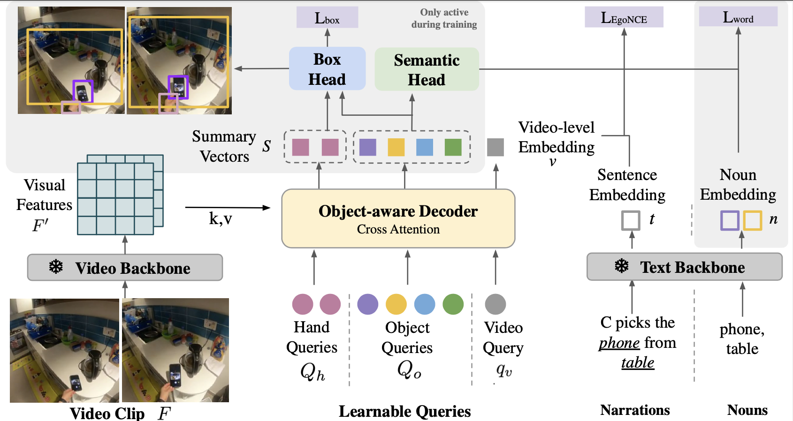

# [ICCV2023] Helping Hands: An Object-Aware Ego-Centric Video Recognition Model

[**Helping Hands: An Object-Aware Ego-Centric Video Recognition Model**](https://arxiv.org/pdf/2308.07918.pdf)                                     
Chuhan Zhang, Ankush Gupta, Andrew Zisserman         
(ICCV 2023 | [arxiv](https://arxiv.org/pdf/2308.07918.pdf) | [bibtex](https://www.robots.ox.ac.uk/~czhang/helpinghand-bibtex.txt)) 

We introduce an object-aware decoder for improving the performance of spatio-temporal representations on ego-centric videos. The key idea is to enhance object-awareness during training by tasking the model to predict hand positions, object positions, and the semantic label of the objects
using paired captions when available. At inference time the model only requires RGB frames as inputs, and is able to track and ground objects (although it has not been trained explicitly for this).



## 💾 Data Preparation

- **Videos**: Please download the videos from the original source and put it in the `data_dir`: EgoClip/EgoMCQ[[Download]](https://github.com/showlab/EgoVLP/tree/main); EpicKitchens[[Download]](https://epic-kitchens.github.io/2022) ;EGTEA[[Download]](https://cbs.ic.gatech.edu/fpv/)
- **Annotations**: We pack all the annotations (both original and post-processed) we need for downloading [[Download]](https://www.robots.ox.ac.uk/~czhang/metadata.zip). Please download it and put it in the `meta_dir`
- **Pretrained Model weights**: The model has two parts: 1. frozen encoders from LaviLa [[Download]](https://dl.fbaipublicfiles.com/lavila/checkpoints/dual_encoders/ego4d/clip_openai_timesformer_large.narrator_rephraser.ep_0003.md5sum_c89337.pth) 2. Our module trained on top of the encoders [[Download]](https://www.robots.ox.ac.uk/~czhang/helping-hand-ckpt-nq12.pth.tar)
- **Hand-Object boxes**: We extracted hand-object boxes from 640p images in EgoClip using [100DOH](https://github.com/ddshan/hand_detector.d2) and use them for supervision. The extracted boxes can be downloaded here: [[Download]](https://www.robots.ox.ac.uk/~czhang/hand_object_clip_per_video_4f_lavila_narrator_640.zip)(~1.8G)

## 🏋️ Pretraining
```
python train.py   --backbone LaviLa  --num_queries 12  --name_prefix /work/czhang/EgoVLP/github/ --data_dir /path/to/ego4d/videos  --meta_dir ./data/EgoClip
```


## 🔑 Zero-shot evaluation
Zero-shot on EgoMCQ
```
python test_EgoMCQ.py    --data_dir ./data/EgoClip --meta_dir /path/to/meta/dir --num_queries 12 --num_frames 16  --resume /path/to/model_weights --lavila_weights_path  /path/to/lavila_weights
```
Zero-shot on Epic-Kitchens MIR
```
python test_epic.py  --data_dir ./data/epic_kitchens --meta_dir /path/to/meta/dir --num_queries 12 --num_frames 16  --resume /path/to/model --lavila_weights_path  /path/to/lavila_weights
```
Zero-shot on EGTEA
```
python test_epic.py  --data_dir ./data/epic_kitchens --meta_dir /path/to/meta/dir --num_queries 12 --num_frames 16  --resume /path/to/model --lavila_weights_path  /path/to/lavila_weights
```

## 🛠 Finetuning on Episodic Memory
Finetuning on EgoNLQ/EgoMCQ
we extract the features from pretrained model using code [here](https://github.com/showlab/EgoVLP/tree/main) and do finetuning with code [here](https://github.com/QinghongLin/EgoVLP_episodic_memory)


## 👁 Visualization of Grounding Results
*Please note the objective of the paper is to do vision-language understanding, and the model was trained on grounding as an auxiliary tasks with noisy boxes as supervision, it may not predict perfect grounding results. 

We extracted hand and object boxes ([download](https://www.robots.ox.ac.uk/~czhang/predicted_grounding.pth.tar)) on EgoClip using our model with 4 object queries ([model_weights](https://www.robots.ox.ac.uk/~czhang/helping-hand-ckpt-nq4.pth.tar)).
The file has information of video and the boxes in it as:
```
Dict{
  video_uid: Str                                                             # the uid of video in egoclip
  start_sec: Float                                                           # the start timestamp of the clip
  end_sec: Float                                                             # the end timestamp of the clip
  samples_sec: List[Floats]                                                  # a list of four timestamps where the frames are sampled from
  object_boxes: Dict{object1_name:[object1_box_t1,object1_box_t2,] ....}     # nouns in the narrations and their corresponding trajectory 
  hand_boxes: Dict{hand1:[hand1_box_t1,hand1_box_t2,...], hand2:...}         # trajectory of left and right hand 
}
```
To visualize the boxes on RGB frames, please download the boxes and put them into run `/path/to/boxes` the following command:
```
cd demo
python visualize_box.py --video_dir /path/to/egoclip/videos --anno_file /path/to/boxes
```

## 🙏  Acknowledgements

This code is based on [EgoVLP](https://github.com/showlab/EgoVLP) and [LaViLa](https://github.com/facebookresearch/LaViLa), If you use this code, please consider citing them. 

## 📰 Citation
```
@inproceedings{zhanghelpinghand,
  title={Helping Hands: An Object-Aware Ego-Centric Video Recognition Model},
  author={Chuhan Zhang and Ankush Gputa and Andrew Zisserman},
  booktitle={International Conference on Computer Vision (ICCV)},
  year={2023}
}
```

## 📩 Contact
If you have any question, please contact czhang@robots.ox.ac.uk .
